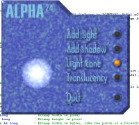



## Alpha24

### Description

Alpha24 is an assembler library providing highspeed alphatranslucency operations, for example lighting, shading and overlaying of images to VB developers. It's about as easy to use as VB PaintPicture, and comes with a fully documented sample application. It doesn't need any additional libraries like DirectX and will even run under NT. Get it now, its for free!

Alpha24 will work with VB picture objects, GDI bitmaps or DirectX surfaces. It will run on any Pentium PC (the drawback of this is that it's not optimized for MMX), under 95, 98, 00 or even NT. The actual libary is about 16kB in size. Assembler sourcecode is provided and fully documented. I've tried to write it as much "VB-style" as possible, sparing many of the more advanced optimizations so that everyone can study it.

IMPORTANT: Alpha24 will only run under 24-bit color mode!
 
### More Info
 

             |
---                |---
**Submitted On**   |1999-07-10 15:47:10
**By**             |[Wolfgang Kienreich](https://github.com/Planet-Source-Code/PSCIndex/blob/master/ByAuthor/wolfgang-kienreich.md)
**Level**          |Intermediate
**User Rating**    |4.6 (32 globes from 7 users)
**Compatibility**  |VB 4\.0 \(32\-bit\), VB 5\.0, VB 6\.0
**Category**       |[Graphics](https://github.com/Planet-Source-Code/PSCIndex/blob/master/ByCategory/graphics__1-46.md)
**World**          |[Visual Basic](https://github.com/Planet-Source-Code/PSCIndex/blob/master/ByWorld/visual-basic.md)
**Archive File**   |[CODE\_UPLOAD1061610122000\.zip](https://github.com/Planet-Source-Code/wolfgang-kienreich-alpha24__1-12024/archive/master.zip)

